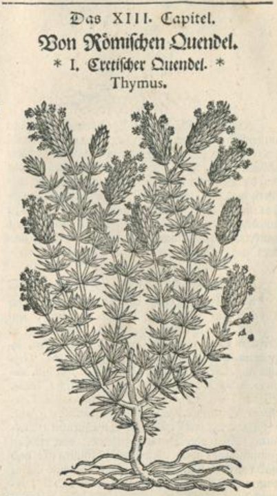

Kakukkfű
========

Eretai kakukkfű
---------------

Dioszkoriész írta le a "Római Quendel"-t (kakukkfüvet) a harmadik könyvében, mint egy kicsi poros levelű növény,
aminek a szárát sok kettőzött hajtás veszi körül finom kis keskeny levelekkel,
a tetején korpa szerű bimbókkal, és kis szép lila virágokkal.
a növényen nem érezni magokat, mivel az a megrepedt bimbóból nő ki, vagy a leszáradt, földre hullott virágból
A gyökere fás, gyógyászatban nem használják.
A legjobb Kakukkfű <<Eretában>> nő (trák, esetleg spanyol vagy grúz város -> a trák eredetre utalhat, hogy más forrásban is olvasható, hogy a mai Bulgáriában nagyon elterjedt: https://hu.wikipedia.org/wiki/kakukkf%C5%B1?), de Velszben (?) és Spanyolországban
is szívesen nő egyébként nem jó termőértékű, köves talajon.
Nagyon lassan virágzik, ahogy <<Teoph.>> írja.

(Internetes kutatás után valószínűleg itt a keskenylevelű kakukkfűről írtak, más néven mezei kakukkfű vagy északi kakukkfű. Latinul: Thymus serpyllum)

Római vagy velszi kakukkfű
--------------------------

A kakukkfű másik fajtája, amiből a kertjeinkben sok van, nem olyan keskeny levelekkel rendelkezik, mint az előző fajta
de egyébként levelek, a virágzat és az illat majdnem azonos. Csupán a levelek ezen a fajtán kicsit sötétebb zöld árnyalatúak
az illata is erősebb, de kellemesebb is. Ez a növény is Velszből (<<Welschland>>) lett idehozva és szorgalmas kertészek tartották meg,
de nem csak kertekben található meg, hanem edényben is, mint egy kis fácska.

Neve
----

A "Római vagy Velszi (?) Quendel" vagy <<Thymiankraut>> (kakukkfű), latinul Thymus vagy 
(...), franciául Thym vagy Marricolaine d' Angleterre, spanyolul Tomillo salsero, cseh nyelven thym
a másik "Thym", "Demuth" (alázatosság), "Immenkraut" (méhfű - "mert sok rajta a méh")

Dioszkoriész <<thymum durius>>-nak (kemény kakukkfűnek ?) nevezi

Használata
----------

Belsőleg
--------

Külsőleg
--------

Szirupja
--------
+------------------------------------------------------+
|  A kakukkfűszirup:                                   |
+======================================================+
| A kakukkfűszirup a következőképpen készül:           |
| Végy egyet a felső hajtásokból a legjobb illatú      |
| kakukkfűből 4 lat (<<Loth>>), mezei mentával együtt  |
| szárított fodormenta...                              |
|                                                      |
+------------------------------------------------------+
Bor
---

Olaja
-----

Párlata
-------

